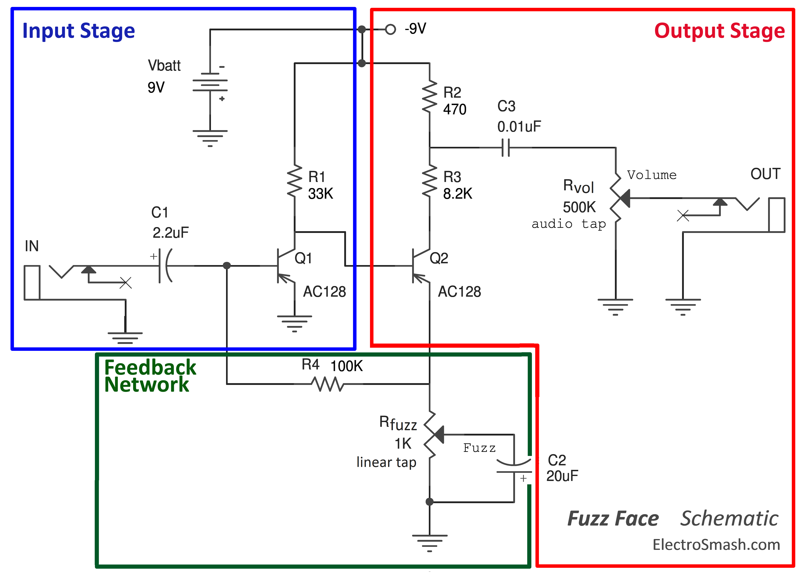
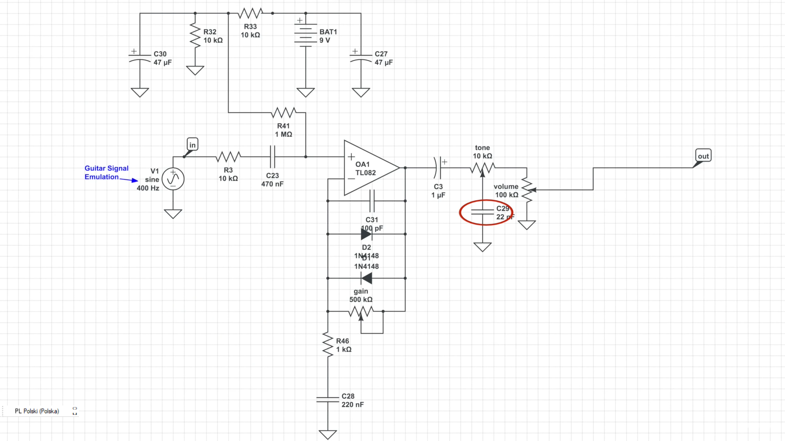

# DYI GUITAR PEDALS

Presentation of my DYI guitar pedals that I mademade back in 2022, before taking a university course.

## Fuzz Face
Classic fuzz circuit which was used  by Jimmy Hendrix. Placed in 1590B enclosure and with true bypass switching.

## Overdrive
Simple overdrive circuit which uses TL072 op-amp as a non-inverting amplifier and diodes in soft-clipping configuration for creating distortion.

